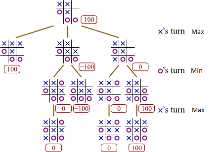

# 
XO is Unbeatable

A tic-tac-toe game playing against my AI, you can now try beating it <a href="https://photkosee.github.io/xo-is-unbeatable/">here</a>

## Background

Last week, during my AI class, I was introduced to an AI playing tic-tac-toe using the Minimax algorithm. I was excited and planned to bring it to life. Since building a tic-tac-toe on the front end will not take long, and I enjoy doing front-end work a lot, this is going to be a mini-project. Now is a good time for me to get a good understanding of this algorithm.

## Minimax Algorithm

The algorithm works by considering when players taking turns. Each aiming to maximize their score while minimizing their opponent's score. The algorithm would ends up looking like a tree of possible outcomes when each player taking turns in any possible ways.

> Thank you for the image from [this site](https://blog.aaronccwong.com/2018/i-created-an-ai-that-beats-me-at-tic-tac-toe/).

As you could see when X is taking a turn in the second level of the tree. In the image above, if X wins the game, the score will be 100. If X loses the game, the score will be -100. And the score will be 0 if it's a tie. Then, X will pick the maximum score in it's trun while picking the minimum score in its opponent's turn. Representing the most optimal move for X.
