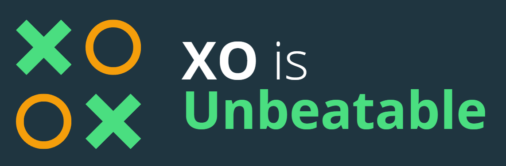

# <p align="center"><a href="https://photkosee.github.io/xo-is-unbeatable/"></a></p>

<p align="center">
A tic-tac-toe game playing against my AI, you can now try beating it <a href="https://photkosee.github.io/xo-is-unbeatable/">here!</a>
</p>

## Table of Contents

1. [Inspiration](#inspiration)
2. [What this does?](#what-this-does)
3. [Minimax](#minimax)
4. [Alpha-Beta Pruning](#alpha-beta-pruning)
5. [Negamax](#negamax)
6. [Built with](#built-with)
7. [Author](#author)
8. [Deployment](#deployment)

## Inspiration

Last week, during my AI class, I was introduced to an AI playing tic-tac-toe using the Minimax algorithm. I was excited and planned to bring it to life. Since building a tic-tac-toe on the front end will not take long, and I enjoy doing front-end work a lot, this is going to be a mini-project. Now is a good time for me to get a good understanding of this algorithm.

## What this does?

Users will be able to choose whether to play first or second in a tic-tac-toe game against my AI, which is implemented using Alpha-Beta Pruning Algorithm. Note that my AI never loses!

## Minimax

The algorithm explores all possible moves and counter-moves and make decisions based on the assumption of optimal play by both players, to determine the best move for the current player.

## Alpha-Beta Pruning

The Alpha-Beta Pruning is like Minimax but can reduce the number of nodes evaluated in the search tree, improving the efficiency of the search. By keeping track of alpha, the best value that the maximizing player can currently do, and beta, the best value the minimizing player can currently do.

And whenever the value of a node exceeds the beta value at any point during the search, then further exploration can be skipped since it won't affect the final result, it implies that the current player has already found a better move that all further moves wouldn't be as good.

## Negamax

A simplified version of Minimax, combining functions for maximizing and minimizing players into one. The value of a postion for one player is the negation of the value for the other player, called zero-sum.

```
const alphabeta = (
    newBoard: Array<"X" | "O" | "">,
    currPlayer: "X" | "O",
    depth: number,
    alpha: number,
    beta: number,
    bestMove: Array<number>
) => {
  let bestEvaluation: number = -Infinity;
  const opponent: "X" | "O" =
    currPlayer === "X" ? "O" : "X";

  // When there is a winner
  if (checkWinner(newBoard, opponent)) {
    return -10000 + depth;
  }

  let currMove = 0;
  newBoard.forEach((box, idx) => {
    // Check for available moves
    if (box === "") {
      const tmpBoard = [...newBoard];
      currMove = idx;
      // Try this move
      tmpBoard[currMove] = currPlayer;
      const currEvaluation: number = -alphabeta(
        tmpBoard,
        opponent,
        depth + 1,
        -beta,
        -alpha,
        bestMove
      );

      if (currEvaluation > bestEvaluation) {
        bestEvaluation = currEvaluation;
        bestMove[depth] = currMove;
        if (bestEvaluation > alpha) {
          alpha = bestEvaluation;

          // Pruning
          if (alpha >= beta) {
            return alpha;
          }
        }
      }
    }
  });

  if (currMove === 0) {
    return 0;
  } else {
    return alpha;
  }
};
```

## Built with

- [Vite 5](https://vitejs.dev/) - Development environment
- [React 18](https://react.dev/) - Development environment
- [Tailwind CSS](https://tailwindcss.com/) - CSS framework
- [Next UI](https://nextui.org/) - Components library for User Interface

## Author

Phot Koseekrainiramon
- [LinkedIn](https://www.linkedin.com/in/photkosee/)
- [GitHub](https://github.com/photkosee)

## Deployment

This project is deployed to GitHub Pages:

[https://photkosee.github.io/xo-is-unbeatable/](https://photkosee.github.io/xo-is-unbeatable/)

### Log

- 21/04/2024 Utilize Alpha-Beta Pruning (Negamax) for better performance
